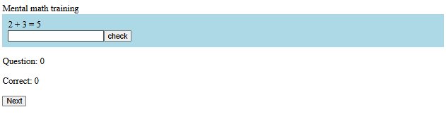

# speedMath Training
A website for training mental math (coming!)
>This is one of my projects for Stardance by Hack club. Not ready yet.

## ℹ️ Overview
> Note: this project contains currently only the frontend. The backend exists but there isn't much. I might do something with later.

I wanted to create this website do I could maintain my mental math skills. Nowadays I use a calculator most of the time in math classes and I've noticed I'm not as fast as I used to be in headcounts.

When I started to look for an already existing site, I found many but none of them was exactly what I wanted or needed. So I decided to make my own. 
### Why speedMath Training is different:
- No login
- A good (or at least better) UI
- Questions that are as customizable as possible
- Simple layout
- A cute mascot Calc

## Try It! ▶️
* (Link here)
The website is optimized for a computer screen. It works also on mobile but there might be some issues with responsive design.

## How to run 🏃
Clone repository:
```bash
git clone https://github.com/ViLP357/speedMathTraining.git
```
Install depencies:
```
npm install 
```

In main folder speedMathTraining go to...
``` 
/frontend/speedMathTrainingFrontend

```

and

```
npm run dev
```

or

``` 
npm run build
npm run preview
```

## Developing process 💻
This is how the website looked in the beginning of Stardance

There was only that simple question form and some hard-coded questions that I had managed to do in less than 5hr beside configuring everything.

## Technologies 🔧 
### Frontend
- Typescript
- React
### Building-tools
- Vite
### Developing environment
- Node.js
### Drawing
- paint.net
